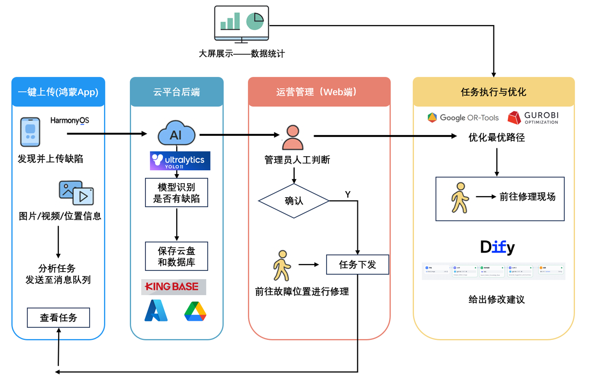
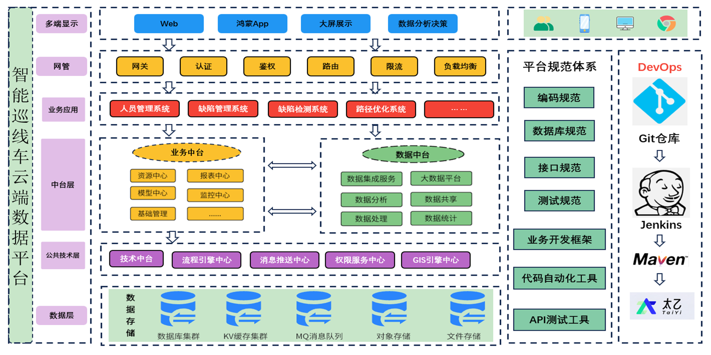

# 🚗 智能汽车管理系统后端

<div align="center">


**一个功能强大的智能汽车管理系统后端服务**

[功能特性](#-功能特性) • [技术栈](#-技术栈) • [快速开始](#-快速开始) • [API文档](#-api文档)

</div>

---



> **图1：缺陷检测与任务流转全生命周期流程**

---

## ✨ 功能特性

### 🔐 用户权限管理
- **用户注册登录** - 安全的JWT认证机制
- **角色权限控制** - 基于角色的访问控制(RBAC)
- **菜单权限管理** - 动态菜单权限分配
- **部门管理** - 组织架构管理

### 🚗 汽车管理
- **故障管理** - 汽车故障记录与处理
- **任务管理** - 维修任务分配与跟踪
- **系统配置** - 灵活的系统参数配置

### 📁 文件管理
- **文件上传** - 支持图片等文件上传
- **文件存储** - 本地文件存储管理

### 🛠️ 系统特性
- **RESTful API** - 标准化的API设计
- **分页查询** - 高效的数据分页
- **数据验证** - 完善的输入验证
- **异常处理** - 统一的异常处理机制

## 🛠️ 技术栈

| 技术 | 版本 | 说明 |
|------|------|------|
| **Java** | 17+ | 核心开发语言 |
| **Spring Boot** | 3.0+ | 应用框架 |
| **MyBatis** | 3.5+ | ORM框架 |
| **Kingbase** | 8.0+ | 国产数据库 |
| **JWT** | - | 身份认证 |
| **BCrypt** | - | 密码加密 |
| **Maven** | - | 项目管理 |

## 🚀 快速开始

### 环境要求
- JDK 17+
- Kingbase 8.0+ (国产数据库)
- Maven 3.6+

### 安装步骤

1. **克隆项目**
```bash
git clone <repository-url>
cd backend
```

2. **配置数据库**
```sql
-- 创建数据库
CREATE DATABASE smart_car_db;

-- 设置字符集
ALTER DATABASE smart_car_db SET client_encoding = 'UTF8';

-- 导入数据表结构
sys_menu_table.sql
```

**Kingbase数据库特殊要求：**
- 支持国产化部署，符合国家信息安全要求
- 兼容PostgreSQL语法，支持标准SQL
- 支持事务处理、存储过程、触发器等功能
- 提供完整的数据备份和恢复机制

3. **配置应用**
编辑 `src/main/resources/application.yml`：
```yaml
spring:
  datasource:
    url: jdbc:kingbase8://localhost:54321/smart_car_db
    username: your_username
    password: your_password
    driver-class-name: com.kingbase8.Driver
    hikari:
      maximum-pool-size: 20
      minimum-idle: 5
      connection-timeout: 30000
      idle-timeout: 600000
      max-lifetime: 1800000
```

4. **运行项目**
```bash
# 使用Maven
mvn spring-boot:run

# 或使用Maven Wrapper
./mvnw spring-boot:run
```

5. **访问应用**
```
http://localhost:8080
```

## 📚 API文档

### 认证相关
- `POST /api/login` - 用户登录
- `POST /api/register` - 用户注册

### 用户管理
- `GET /api/users` - 获取用户列表
- `POST /api/users` - 创建用户
- `PUT /api/users/{id}` - 更新用户
- `DELETE /api/users/{id}` - 删除用户

### 角色管理
- `GET /api/roles` - 获取角色列表
- `POST /api/roles` - 创建角色
- `PUT /api/roles/{id}` - 更新角色
- `DELETE /api/roles/{id}` - 删除角色

### 故障管理
- `GET /api/defects` - 获取故障列表
- `POST /api/defects` - 创建故障记录
- `PUT /api/defects/{id}` - 更新故障信息
- `DELETE /api/defects/{id}` - 删除故障记录

### 任务管理
- `GET /api/tasks` - 获取任务列表
- `POST /api/tasks` - 创建任务
- `PUT /api/tasks/{id}` - 更新任务
- `DELETE /api/tasks/{id}` - 删除任务

## 📁 项目结构



> **图2：智能巡线车云端数据平台系统架构总览**

```
backend/
├── src/main/java/com/neu/zboyn/car/
│   ├── config/          # 配置类
│   ├── controller/      # 控制器层
│   ├── dto/            # 数据传输对象
│   ├── mapper/         # MyBatis映射器
│   ├── model/          # 实体模型
│   ├── service/        # 服务层
│   └── util/           # 工具类
├── src/main/resources/
│   ├── mapper/         # MyBatis XML映射文件
│   ├── application.yml # 应用配置
│   └── static/         # 静态资源
└── uploads/            # 文件上传目录
```

## 🔧 开发指南

### 数据库配置要求
- **Kingbase驱动依赖** - 需要在pom.xml中添加Kingbase JDBC驱动
- **连接池配置** - 使用HikariCP连接池优化性能
- **字符集设置** - 确保UTF-8字符集支持中文
- **事务管理** - 支持分布式事务处理

### 代码规范
- 遵循阿里巴巴Java开发手册
- 使用统一的代码格式化配置
- 添加必要的注释和文档
- 兼容Kingbase数据库语法特性

### 测试
```bash
# 运行单元测试
mvn test

# 运行集成测试
mvn verify
```

### 构建
```bash
# 构建项目
mvn clean package

# 运行JAR包
java -jar target/car-0.0.1-SNAPSHOT.jar
```

## 🤝 贡献指南

1. Fork 项目
2. 创建功能分支 (`git checkout -b feature/AmazingFeature`)
3. 提交更改 (`git commit -m 'Add some AmazingFeature'`)
4. 推送到分支 (`git push origin feature/AmazingFeature`)
5. 打开 Pull Request

## 🔒 安全与合规

### 国产化要求
- **数据库国产化** - 使用金仓数据库Kingbase，符合国家信息安全要求
- **自主可控** - 核心数据库技术自主可控，保障数据安全
- **合规认证** - 通过国家相关安全认证标准
- **数据加密** - 支持数据加密存储和传输

## 📄 许可证

本项目采用 MIT 许可证 - 查看 [LICENSE](LICENSE) 文件了解详情

## 📞 联系我们

- 项目维护者: [Zboyn]()
- 邮箱: [zboyn@qq.com]()
- 项目地址: [https://github.com/ZBoyn/backend]

---

<div align="center">

**⭐ 如果这个项目对你有帮助，请给它一个星标！**

Made with ❤️ by [Software 27]()

</div> 